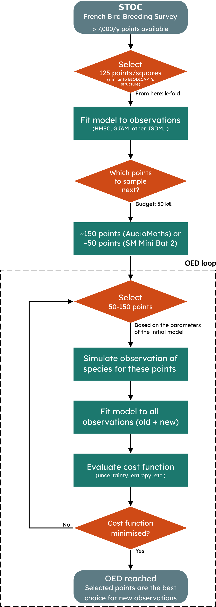
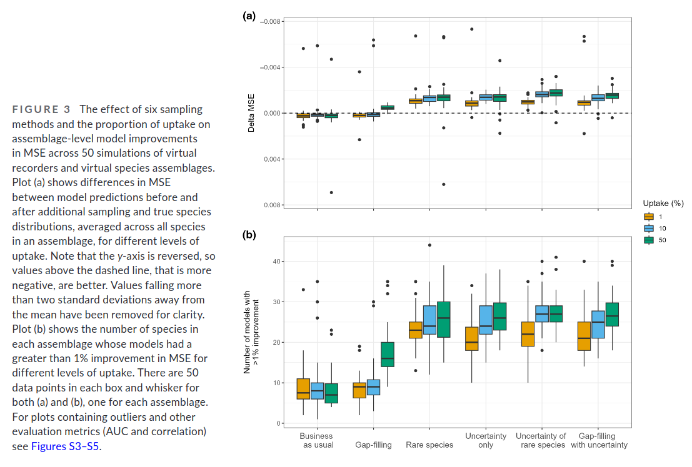

\thispagestyle{empty}
\newpage

# Introduction
## OED
**Optimal Experimental Design** (or OED for short) is a method for designing experiments that aims at maximising information gain while minimising a cost function. This cost function can encompass uncertainty, cost, time... it is up 
to the user to select the parameters to optimise.

[The key concept is that **not all observations are equally informative**.]{.mark} 

This concept[^1] can be particularly interesting when working with participatory science datasets, which is the case of the **STOC** dataset, which we are using here.

[^1]: Sometimes, also referred to as "adaptive sampling".

## BIODICAPT

BIODICAPT is a French initiative that aims at monitoring biodiversity of agricultural lands on a large (*aka national*) scale through the use of various recording devices.

BIODICAPT started in early-2026, the first results (data extraction of species distributions) will not be available until late-2026 or early-2027. That is why, in the meantime, we are going to use **STOC** to prepare our workflow.

## Strategy
With OED, the question we want to answer is simple: **which points are most informative in the 500ENI network, given our previous data collection and our constraints?**

For that, we'll use explicative variables collected on site (temperatures, precipitation, type of land, ...), response variables obtained from recorders (presence-absence of birds species mainly), and Species Distribution Models (SDM), in particular HMSC, which is a joint-SDM (JSDM) [@ovaskainen_how_2017]. These models make use of several species distributions to find *latent* links between them, which supposedly improves the prediction accuracy.

They are opposed to single SDMs (Species Distribution Models applied to one species) and SSDMs (Stacked SDMs, are mutliple SMDs glued together, with no link between them).

### HMSC
HMSC (Hierarchical Modelling of Species Communities) is a JSDM developped by Ovaskainen et al. (2017) [@ovaskainen_how_2017], it is distributed as an open-source R-package on [GitHub](https://github.com/hmsc-r/HMSC/) [@tikhonov_joint_2020]. 

It is undoubtebly the most widely used JSDMin the last years. To summarise its principle, take a quick look at Figure 4, from their original publication [@ovaskainen_how_2017]:

![Copy of Figure 4 from Ovaskainen et al. (2017) [@ovaskainen_how_2017]](images/figure4_ovaskainen_2017.png)

### GJAM
::: {.callout-caution collapse="true"}
## Work in progress...

Only HMSC has been implemented into our code for now. GJAM is under consideration, as well as other SDMs: RF, SSDM, deep-SDMs, ...

↳ This section will be updated when new results are available.
:::

# Materials & Methods {#mat-met-stoc-oed}
We use a dataset that is already curated and known to work with HMSC: **STOC** [@valle_species_2024]. 

The French Breeding Bird Survey (FBBS, or STOC in french) is a standardised multi-species abundance dataset, based on a citizen science program. It contains bird sightings and explanatory/environmental variables. Since it is already pre-processed, we can work directly with it, out of the box.

{height=750}


# Results
## Adding new points
First, we want to make sure that, following the [flowchart](#mat-met-stoc-oed) above, we can actually make better models by adding (50-150) new points to our dataset.

### Reference results
To test this, we draw on *Mondain-Monval et al.* work [@mondainmonval_adaptive_2024]. However, it is only a base on which we build, not an exact replica as our method and dataset are quite different from the original *Mondain-Monval et al.* publication:


| Parameter            | M.M.                                     | Ours                    |
|:--------:            |:-------------:                           |:-----:                  |
| Dataset              | Simulated with `virtualspecies` package  | STOC annual sampling    |
| Number of species    | 50 species                               | 15 species              |
| Number of variables  | 10 (randomly selected from 33 available) | 6 (direct from STOC)    |
| Model type           | Ensemble model (GLM + GAM + RF)          | HMSC                    |
| Re-training strategy | Re-sampling of 1%, 10% or 50% of dataset | Addition of new samples (50) |
| Training size        | 2000 cells                               | 125 cells + new data    |

With this context in mind, here are their results:



### Our results
How much does the model improve when adding 50 new samples to the *base* dataset (125 samples)?

We investigate this depending on different strategies.

```{r}
#| label: Global setup
#| echo: false
#| warning: false
renv::load(here::here())

##### Libraries ##### ---------------------------------------------------------
suppressPackageStartupMessages(library(dplyr))
suppressPackageStartupMessages(library(cli))
suppressPackageStartupMessages(source(here::here(
    file.path("R", "utils_figures.R"))))
suppressPackageStartupMessages(source(here::here(
    file.path("R", "utils_models.R"))))

##### Parameters ##### --------------------------------------------------------
source(here::here(file.path("data","config","config.R")))
COLUMN <- "strategy"
SUBFOLDER <- "STOC-OED"
parameters <- readRDS(here::here(
    file.path(RESULTS_PATH, SUBFOLDER, "parameters.rds")))
COMBINATIONS <- parameters$COMBINATIONS
```

::: {.panel-tabset}
#### Boxplot differences 
[]{#tab-boxplot-differences}
```{r}
#| label: Strategies setup
#| echo: false
#| warning: false
loop_on <- "STRATEGIES"
combination <- COMBINATIONS[[4]]

if (any(sapply(combination[[loop_on]], is.numeric))) {
    combination[[loop_on]] <- sort(combination[[loop_on]])
}
ref_model <- list()
loop_model <- list()

for (name in names(combination) ) {
    if (name == loop_on) {
        ref_model[[name]] <- combination[[name]][1]
        loop_model[[name]] <- combination[[loop_on]][-1]
    } else {
        ref_model[[name]] <- combination[[name]]
        loop_model[[name]] <- combination[[name]] 
    }
}
```


```{r, fig.dim=c(11, 6)}
#| label: Strategies boxplots
#| echo: false
#| warning: false
. <- suppressMessages(boxplot_compare_scores(
    parent_folder = here::here(file.path(RESULTS_PATH, SUBFOLDER)),
    reference_model_combination = ref_model, 
    loop_model_combination = loop_model, 
    loop_on = loop_on,
    k_fold = parameters$K_FOLDS, 
    metric = "MSE",
    subset_names = c("train", "val", "test"),
    xlabel = paste0(
        "Effect of ", tolower(loop_on),
        ", compared to '", ref_model[[loop_on]], "'"), 
    group_species = TRUE,
    species_names = parameters$Y_SPECIES))
```

#### Boxplot improvement 
[]{#tab-boxplot-improvement}

```{r, fig.dim=c(11, 6)}
#| label: Strategies boxplots bis
#| echo: false
#| warning: false
. <- suppressMessages(boxplot_sp_improvements(
    parent_folder = here::here(file.path(RESULTS_PATH, SUBFOLDER)),
    reference_model_combination = ref_model, 
    loop_model_combination = loop_model, 
    loop_on = loop_on,
    k_fold = parameters$K_FOLDS, 
    metric = "MSE",
    xlabel = paste0(
            "Effect of ", tolower(loop_on),
            ", compared to '", ref_model[[loop_on]], "'"), 
    subset_names = c("train", "val", "test"),
    proportion = 1/100))
```

#### Estimated effects 
[]{#tab-estimated-effects}

```{r, fig.dim=c(11, 6)}
#| label: Strategies dotwhisker
#| echo: false
#| warning: false
#| output: true
strat_stats <- suppressMessages(dotwhisker_model_scores(
    parent_folder = here::here(file.path(RESULTS_PATH, SUBFOLDER)),
    loop_model_combination = combination, 
    loop_on = loop_on,
    k_fold = parameters$K_FOLDS, 
    metric = "MSE",
    xlabel = paste0(
        "Estimated MSE coefficient relative to '", ref_model[[loop_on]], "'"),
    ylabel = paste0("Effect of ", tolower(loop_on)," type on MSE"),
    group_species = TRUE,
    species_names = parameters$Y_SPECIES))
```
:::

*BAU: Business-as-usual; GF: Gap-filling; SU: Simplified-uncertainty; XPSU: SU divided in X parts*

**Fitted model:**
```{r}
#| label: Strategies stats
#| echo: false
#| warning: false
#| output: true
print(summary(strat_stats$models$test), correlation = FALSE)
```

### Conclusions
These results show that, when adding 50 new points to our training set (125 points), training, test and validation scores vary depending on the strategy chosen to add those points.

In details "BAU", "GF" and "SU" improve significantly the results in test (compared to the "base" model which is not adding new points), while worsening results in training (expected since unknown points are added to the training set). 

Interestingly, adding new samples on several iterations (i.e. in 2 times with "2PSU", or 3 times with "3PSU") instead of all at once (i.e. "SU") yields to differences in scores. It seems like "2PSU" scores are closer to the one of the base strategy, while "3PSU" scores show improvement comparable to "SU" and "GF" (clearer on [this plot](#tab-boxplot-improvement)).

Overall however, these effects sizes (~0.0025 in MSE units) are small relative to the residual noise (SD ≈ 0.0086) and an order of magnitude smaller than between-species variability (SD ≈ 0.076).


### Comparison with Mondain-Monval et al.

Mondain-Monval et al. [@mondainmonval_adaptive_2024] and we computed the difference in MSE between a base strategy (business-as-usual) and other strategies. However, our training sets were not built in the same way:
- Mondain-Monval et al. [@mondainmonval_adaptive_2024] **changed a proportion of their training set** (1%, 10%; 50%) according to the chosen strategy.
- We **added new samples to our training set** (50, with a base strategy of 125 samples) according to the chosen strategy.

Our figures also show scores in train/val/test. We assume Mondain-Monval et al. [@mondainmonval_adaptive_2024] show only scores in test.

In our results, differences in MSE between resampling strategies are slight, less marked than those of [@mondainmonval_adaptive_2024]. Statistical tests reveal that there are significant differences in the test scores compared to no resampling. Interestingly, the "SU" strategy does not clearly yields to the best results (which was what we expected from [@mondainmonval_adaptive_2024]). 

An interesting continuation is to look at the effect of adding more or less points, depending on the strategy. We chose "GF", "SU" and "3PSU" to investigate this further.


## How many points to add? 
### Effect using "GF"
::: {.panel-tabset}
```{r}
#| label: GF new samples setup
#| echo: false
#| warning: false
loop_on <- "NEW_SAMPLE_SIZES"
combination <- COMBINATIONS[[6]]

if (any(sapply(combination[[loop_on]], is.numeric))) {
    combination[[loop_on]] <- sort(combination[[loop_on]])
}
ref_model <- list()
loop_model <- list()

for (name in names(combination) ) {
    if (name == loop_on) {
        ref_model[[name]] <- combination[[name]][1]
        loop_model[[name]] <- combination[[loop_on]][-1]
    } else {
        ref_model[[name]] <- combination[[name]]
        loop_model[[name]] <- combination[[name]] 
    }
}
```

#### Boxplot differences 
[]{#tab-boxplot-differences-1}

```{r, fig.dim=c(11, 6)}
#| label: GF new samples boxplots
#| echo: false
#| warning: false
. <- suppressMessages(boxplot_compare_scores(
    parent_folder = here::here(file.path(RESULTS_PATH, SUBFOLDER)), 
    reference_model_combination = ref_model, 
    loop_model_combination = loop_model, 
    loop_on = loop_on,
    k_fold = parameters$K_FOLDS, 
    metric = "MSE",
    subset_names = c("train", "val", "test"),
    xlabel = paste0(
        "Effect of ", tolower(loop_on),
        ", compared to '", ref_model[[loop_on]], "'"), 
    group_species = TRUE,
    species_names = parameters$Y_SPECIES))
```

#### Boxplot improvement 
[]{#tab-boxplot-improvement-1}

```{r, fig.dim=c(11, 6)}
#| label: GF new samples boxplots bis
#| echo: false
#| warning: false
. <- suppressMessages(boxplot_sp_improvements(
    parent_folder = here::here(file.path(RESULTS_PATH, SUBFOLDER)),
    reference_model_combination = ref_model, 
    loop_model_combination = loop_model, 
    loop_on = loop_on,
    k_fold = parameters$K_FOLDS, 
    metric = "MSE",
    xlabel = paste0(
            "Effect of ", tolower(loop_on),
            ", compared to '", ref_model[[loop_on]], "'"), 
    subset_names = c("train", "val", "test"),
    proportion = 1/100))
```

#### Estimated effects 
[]{#tab-estimated-effects-1}

```{r, fig.dim=c(11, 6)}
#| label: GF new samples lineplot
#| echo: false
#| warning: false
new_sample_stats <- suppressMessages(lineplot_model_scores(
    parent_folder = here::here(file.path(RESULTS_PATH, SUBFOLDER)), 
    loop_model_combination = combination, 
    loop_on = loop_on,
    k_fold = parameters$K_FOLDS, 
    metric = "MSE",
    xlabel = paste0("Effect of ", tolower(loop_on)," type on MSE"), 
    ylabel = "Average score per species",
    group_species = TRUE,
    species_names = parameters$Y_SPECIES))
```
:::

**Fitted model:**
```{r}
#| label: GF new samples stats
#| echo: false
#| warning: false
#| output: true
print(summary(new_sample_stats$models$test), correlation = FALSE)
```


### Effect using "SU"
::: {.panel-tabset}
```{r}
#| label: SU new samples setup
#| echo: false
#| warning: false
loop_on <- "NEW_SAMPLE_SIZES"
combination <- COMBINATIONS[[5]]

if (any(sapply(combination[[loop_on]], is.numeric))) {
    combination[[loop_on]] <- sort(combination[[loop_on]])
}
ref_model <- list()
loop_model <- list()

for (name in names(combination) ) {
    if (name == loop_on) {
        ref_model[[name]] <- combination[[name]][1]
        loop_model[[name]] <- combination[[loop_on]][-1]
    } else {
        ref_model[[name]] <- combination[[name]]
        loop_model[[name]] <- combination[[name]] 
    }
}
```

#### Boxplot differences 
[]{#tab-boxplot-differences-2}

```{r, fig.dim=c(11, 6)}
#| label: SU new samples boxplots
#| echo: false
#| warning: false
. <- suppressMessages(boxplot_compare_scores(
    parent_folder = here::here(file.path(RESULTS_PATH, SUBFOLDER)), 
    reference_model_combination = ref_model, 
    loop_model_combination = loop_model, 
    loop_on = loop_on,
    k_fold = parameters$K_FOLDS, 
    metric = "MSE",
    subset_names = c("train", "val", "test"),
    xlabel = paste0(
        "Effect of ", tolower(loop_on),
        ", compared to '", ref_model[[loop_on]], "'"), 
    group_species = TRUE,
    species_names = parameters$Y_SPECIES))
```

#### Boxplot improvement 
[]{#tab-boxplot-improvement-2}

```{r, fig.dim=c(11, 6)}
#| label: SU new samples boxplots bis
#| echo: false
#| warning: false
. <- suppressMessages(boxplot_sp_improvements(
    parent_folder = here::here(file.path(RESULTS_PATH, SUBFOLDER)),
    reference_model_combination = ref_model, 
    loop_model_combination = loop_model, 
    loop_on = loop_on,
    k_fold = parameters$K_FOLDS, 
    metric = "MSE",
    xlabel = paste0(
            "Effect of ", tolower(loop_on),
            ", compared to '", ref_model[[loop_on]], "'"), 
    subset_names = c("train", "val", "test"),
    proportion = 1/100))
```

#### Estimated effects 
[]{#tab-estimated-effects-2}

```{r, fig.dim=c(11, 6)}
#| label: SU new samples lineplot
#| echo: false
#| warning: false
new_sample_stats <- suppressMessages(lineplot_model_scores(
    parent_folder = here::here(file.path(RESULTS_PATH, SUBFOLDER)), 
    loop_model_combination = combination, 
    loop_on = loop_on,
    k_fold = parameters$K_FOLDS, 
    metric = "MSE",
    xlabel = paste0("Effect of ", tolower(loop_on)," type on MSE"), 
    ylabel = "Average score per species",
    group_species = TRUE,
    species_names = parameters$Y_SPECIES))
```
:::

**Fitted model:**
```{r}
#| label: SU new samples stats
#| echo: false
#| warning: false
#| output: true
print(summary(new_sample_stats$models$test), correlation = FALSE)
```

### Effect using "3PSU"
::: {.panel-tabset}
```{r}
#| label: 3PSU new samples setup
#| echo: false
#| warning: false
loop_on <- "NEW_SAMPLE_SIZES"
combination <- COMBINATIONS[[7]]

if (any(sapply(combination[[loop_on]], is.numeric))) {
    combination[[loop_on]] <- sort(combination[[loop_on]])
}
ref_model <- list()
loop_model <- list()

for (name in names(combination) ) {
    if (name == loop_on) {
        ref_model[[name]] <- combination[[name]][1]
        loop_model[[name]] <- combination[[loop_on]][-1]
    } else {
        ref_model[[name]] <- combination[[name]]
        loop_model[[name]] <- combination[[name]] 
    }
}
```

#### Boxplot differences 
[]{#tab-boxplot-differences-3}

```{r, fig.dim=c(11, 6)}
#| label: 3PSU new samples boxplots
#| echo: false
#| warning: false
. <- suppressMessages(boxplot_compare_scores(
    parent_folder = here::here(file.path(RESULTS_PATH, SUBFOLDER)), 
    reference_model_combination = ref_model, 
    loop_model_combination = loop_model, 
    loop_on = loop_on,
    k_fold = parameters$K_FOLDS, 
    metric = "MSE",
    subset_names = c("train", "val", "test"),
    xlabel = paste0(
        "Effect of ", tolower(loop_on),
        ", compared to '", ref_model[[loop_on]], "'"), 
    group_species = TRUE,
    species_names = parameters$Y_SPECIES))
```

#### Boxplot improvement 
[]{#tab-boxplot-improvement-3}

```{r, fig.dim=c(11, 6)}
#| label: 3PSU new samples boxplots bis
#| echo: false
#| warning: false
. <- suppressMessages(boxplot_sp_improvements(
    parent_folder = here::here(file.path(RESULTS_PATH, SUBFOLDER)),
    reference_model_combination = ref_model, 
    loop_model_combination = loop_model, 
    loop_on = loop_on,
    k_fold = parameters$K_FOLDS, 
    metric = "MSE",
    xlabel = paste0(
            "Effect of ", tolower(loop_on),
            ", compared to '", ref_model[[loop_on]], "'"), 
    subset_names = c("train", "val", "test"),
    proportion = 1/100))
```

#### Estimated effects 
[]{#tab-estimated-effects-3}

```{r, fig.dim=c(11, 6)}
#| label: 3PSU new samples lineplot
#| echo: false
#| warning: false
new_sample_stats <- suppressMessages(lineplot_model_scores(
    parent_folder = here::here(file.path(RESULTS_PATH, SUBFOLDER)), 
    loop_model_combination = combination, 
    loop_on = loop_on,
    k_fold = parameters$K_FOLDS, 
    metric = "MSE",
    xlabel = paste0("Effect of ", tolower(loop_on)," type on MSE"), 
    ylabel = "Average score per species",
    group_species = TRUE,
    species_names = parameters$Y_SPECIES))
```
:::

**Fitted model:**
```{r}
#| label: 3PSU new samples stats
#| echo: false
#| warning: false
#| output: true
print(summary(new_sample_stats$models$test), correlation = FALSE)
```

## Conclusions
Overall, these results show that the more we add new samples to the training set, the better the models perform on tests sets and validation sets. 

Looking at "Boxplot improvement" plots (for ["GF"](#tab-boxplot-improvement-1), ["SU"](#tab-boxplot-improvement-2), and ["3PSU"](#tab-boxplot-improvement-3) strategies), the effect seems linear when adding new samples using the "SU" strategy, while improvements for "GF" and "3PSU" strategies reach a plateau after 50 new samples added, with no clear progress when adding more samples (100 or 150). This is very interesting as it indicates that, if using an optimal sampling strategy, adding more than 50-100 samples to our original dataset is not very informative. 

## Overall discussion
Other effects (not shown in this report but with figures available in [this folder](../outputs/figures/STOC-OED/)) were investigated. 

Quick summary of results here:
- Training size has a positive effect on test performance. This is the strongest effect measured.
- Sampling strategy: “GF” and “SU” perform significantly better on test data than other strategies.
- Number of new samples (independent of overall training size) and number of explicative variables both show statistically detectable but modest effects in practice.
- Explicit spatial random effects significantly impact training scores and validation scores but not test scores.

It should also be noted that, in our models, **species random effect is high**. As our aim is to generalise the predictions beyond the 15 species used here, this is fine for our usage. However it should be kept in mind that these results are highly species-dependant. 

K-folds random effects are negligible, which is expected and a good thing, meaning that the partitioning of the dataset has very little effect on scores.

Overall, increasing the number of training samples is the dominant lever for improving HMSC model performance, with returns flattening beyond roughly 50-100 sampled plots (with "BAU" strategy for base model). However, this is only true for an initial random sampling of the STOC dataset, what if the initial sampled agricultural plots were not randomly chosen ? (i.e. in BIODICAPT, some explicative variables could be over-represented, which would skew the distributions). We’ll have to change the dataset to see that! 

\newpage