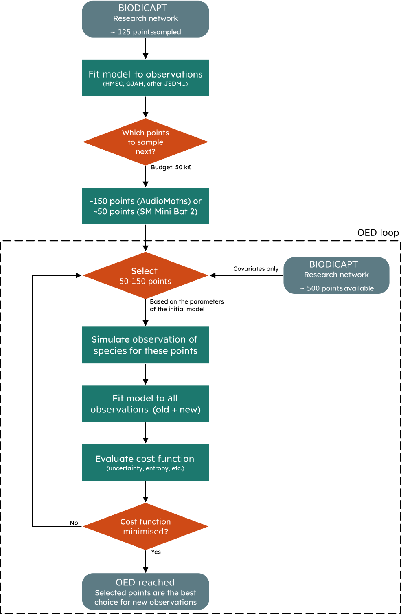
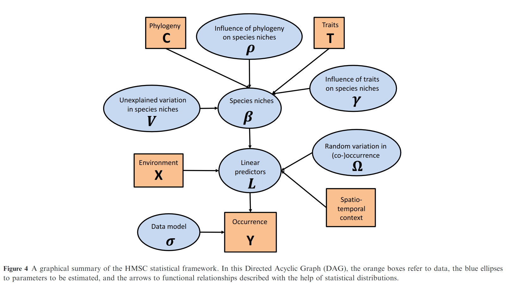

# Methodology
## Strategy for OED
The objective of the BIODICAPT project is to go from a research network to a participatory science network (500ENI). Using data collected in the research network, OED (optimal experimental design) should (in theory) allow us to determine the best points to sample in the 500ENI network to improve the predictive capcity of our model. Sometimes, this concept is referred to as "adaptive sampling".

Overall, the question we want to answer is simple: which points are most informative in the 500ENI network, given our constraints and our knowledge?

## Datasets
### BIODICAPT
Depending on the network, the constraints are very different:
- Research network: professional researchers/technicians, ~125 observations per year, start in 2026.
- 500 ENI network: participatory science, ~500 possible observations (limited by budget), start in 2027.

The goal is to use the data collected in the research network to inform the choice of the agricultural plots that will be sampled in the 500 ENI network. Here is the workflow imagined:

### Placeholder: STOC
BIODICAPT data collection began this year. The dataset will not be complete until the end of 2026, and it will likely take some time to extract species presence/absence from the recordings.

In the meantime, we use the French Breeding Bird Survey (FBBS, or STOC in french). This a standardized multi-species abundance dataset, based on a citizen science program. We use bird sightings from this dataset as response variables. We extract our covariates/explanatory variables from other datasets, and match them to the sightings using the localisation of the observation. Here is the workflow imagined, only slightly modified from the previous one:

### JSDMs

In this project, we use JSDMs (Joint Species Distribution Models) to predict the presence-absence of species. These models make use of several species distributin to find *latent* links between them, which supposedly improves the prediction accuracy.

They are opposed to single SDMs (Species Distribution Models applied to one species) and SSDMs (Stacked SDMs, are mutliple SMDs glued together, with no link between them).

## HMSC
HMSC (Hierarchical Modelling of Species Communities) is a JSDM developped by [Ovaskainen et al. (2017)](https://doi.org/10.1111/ele.12757), it is distributed as an open-source R-package on [GitHub](https://github.com/hmsc-r/HMSC/) [(published by Tikhonov et al., 2019)](https://doi.org/10.1111%2F2041-210X.13345). It is undoubtebly the most widely used JSDMin the last years.

We use it as a base model.

It is described in details by [Ovaskainen et al. (2017)](https://doi.org/10.1111/ele.12757) but, to summarize, a quick look at Figure 4 from their original publication is enough:

## GJAM
> [NOTE]
> TODO
