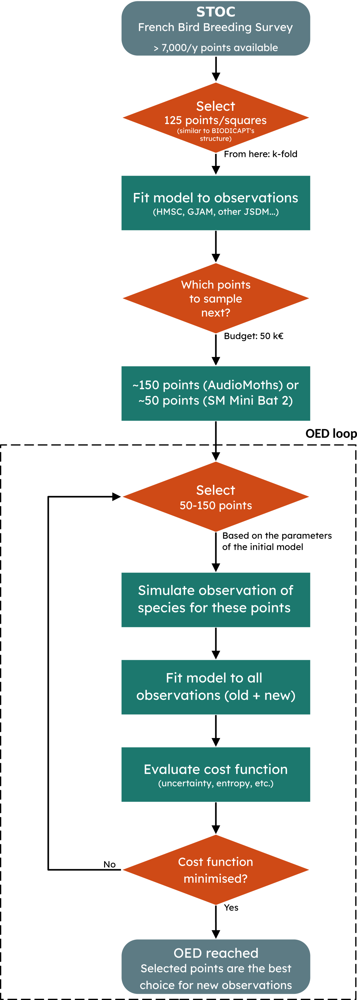
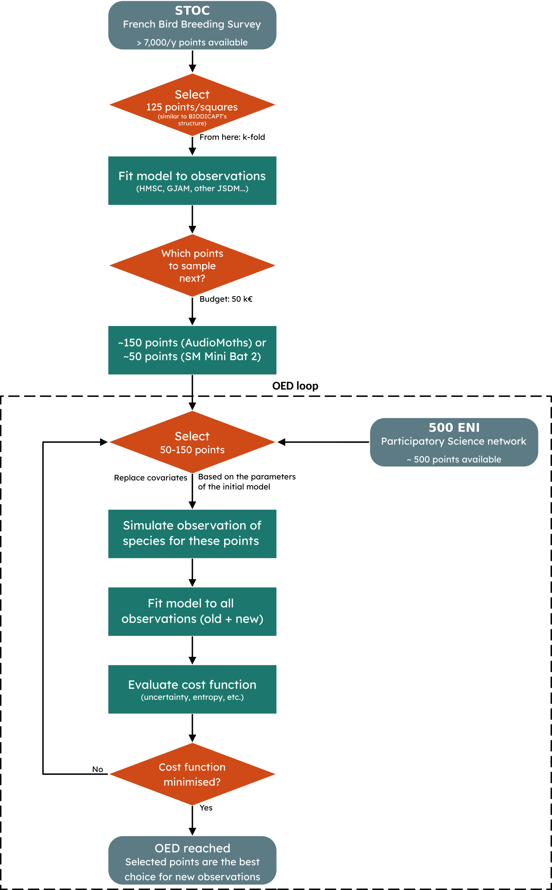

# Methodology
## OED
Optimal Experimental Design (OED) is a method for designing experiments to maximise information gain while minimising uncertainty, cost, time,...

The key concept is that **not all observations are equally informative**. Applied to BIODICAPT, this concept can be particularly interesting when working with 'participartory science' and other fields. Here, we want to find the best argicultural plots to conduct our observation, with the constraints of the project (participatory & reduced budget). 

## Strategy
The objective of the BIODICAPT project is to go from a research network to a participatory science network (500ENI). Using data collected in the research network, OED (optimal experimental design) should (in theory) allow us to determine the best points to sample in the 500ENI network to improve the predictive capcity of our model. Sometimes, this concept is referred to as "adaptive sampling".

Overall, the question we want to answer is simple: which points are most informative in the 500ENI network, given our constraints and our knowledge?

## Datasets
### Proof of concept: STOC-OED
Before using our custom dataset (BIODICAPT & 500 ENI). We can use another dataset, already curated and known to work with JSDMs: STOC. 

The French Breeding Bird Survey (FBBS, or STOC in french) is a standardised multi-species abundance dataset, based on a citizen science program. It contains bird sightings and explanatory/environmental variables. As it is already pre-processed, wa can work directly with it, out of the box.

As we know that HMSC runs on this dataset, even with many variables, many species and random effects [Vallé et al. (2024)](https://doi.org/10.1111/jbi.14752). We only need to create our pipeline and test our OED loop on it, which is the hardest part to engineer.

### Middle ground: 500ENI-STOC-OED
Next, we begin to add our own data.

BIODICAPT data collection began this year (2026). The dataset will not be complete until the end of 2026, and it will likely take some time to extract species presence/absence from the recordings. In the meantine, we can use a mix to mimick the dataset we aim to collect.

We extract our covariates/explanatory variables from publicly available datasets (CHELSA, CORINE Land Cover) to match the environmental variables we want to use in BIODICAPT to the sightings contained in STOC. Then, we try to find the most informative localisation in ENI500 to improve our results, as we would with BIODICAPT's sightings.

Here is the workflow imagined, slightly modified from the previous one:

### Final objective: BIODICAPT-OED
Depending on the network, the constraints in BIODICAPT are very different:
- Research network: professional researchers/technicians, ~125 observations per year, start in 2026.
- 500 ENI network: participatory science, ~500 possible observations (limited by budget), start in 2027.

The goal is to use the data collected in the research network to inform the choice of the agricultural plots that will be sampled in the 500 ENI network. Once this data will be available, instead of using truncated STOC sightings to find the best candidates for sampling in 500 ENI, we will finally use BIODICAPT's data.

Here is the workflow imagined, very similar to the previous one:

## JSDMs

In this project, we use JSDMs (Joint Species Distribution Models) to predict the presence-absence of species. These models make use of several species distributin to find *latent* links between them, which supposedly improves the prediction accuracy.

They are opposed to single SDMs (Species Distribution Models applied to one species) and SSDMs (Stacked SDMs, are mutliple SMDs glued together, with no link between them).

### HMSC
HMSC (Hierarchical Modelling of Species Communities) is a JSDM developped by [Ovaskainen et al. (2017)](https://doi.org/10.1111/ele.12757), it is distributed as an open-source R-package on [GitHub](https://github.com/hmsc-r/HMSC/) [(published by Tikhonov et al., 2019)](https://doi.org/10.1111%2F2041-210X.13345). It is undoubtebly the most widely used JSDMin the last years.

We use it as a base model.

It is described in details by [Ovaskainen et al. (2017)](https://doi.org/10.1111/ele.12757) but, to summarize, a quick look at Figure 4 from their original publication is enough:

### GJAM
> [NOTE]
> TODO
